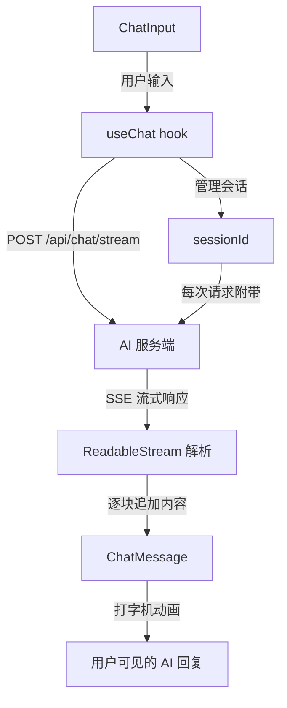

## 产品概述

一个 AI 打字机风格的对话应用，用户可以与 AI 大模型进行实时流式对话。AI 回复以打字机动画逐字呈现，支持会话管理，使 AI 能记住对话上下文。

## 核心功能

- **聊天界面**：用户发送消息，AI 以打字机效果逐字回复
- **流式响应**：通过 SSE (Server-Sent Events) 实时接收 AI 回复，逐块渲染
- **会话管理**：基于 sessionId 维护对话上下文，AI 能记住历史信息
- **打字机动画**：AI 回复文本逐字出现，带有闪烁光标指示正在输出
- **消息历史**：展示完整对话记录，包含用户消息和 AI 回复

## 技术栈

### 前端框架

- **Vite 5** + **React 18** + **TypeScript** 作为项目脚手架
- **Tailwind CSS** 用于样式（快速构建美观的 UI）
- 纯 CSS 实现打字机光标动画（避免引入额外动画库）

### 核心依赖

- 无需额外 UI 组件库，使用 Tailwind CSS 构建所有组件
- 使用浏览器原生 `fetch` + `ReadableStream` 消费 SSE 流式接口

### 技术实现方案

#### 1. 项目结构

```
AI_typewriter_web/
├── index.html
├── package.json
├── tsconfig.json
├── vite.config.ts
├── tailwind.config.js
├── postcss.config.js
├── src/
│   ├── main.tsx              # 入口文件
│   ├── App.tsx               # 根组件，整体布局
│   ├── index.css             # Tailwind 基础样式 + 全局动画
│   ├── components/
│   │   ├── ChatMessage.tsx   # 消息气泡组件（含打字机动画）
│   │   ├── ChatInput.tsx     # 输入框和发送按钮
│   │   └── MessageList.tsx   # 消息列表容器
│   ├── hooks/
│   │   └── useChat.ts        # 聊天核心逻辑 hook
│   └── types/
│       └── chat.ts           # 类型定义
```

#### 2. 核心数据流

```
用户输入 -> ChatInput 组件 -> useChat.sendMessage()
  -> 构建请求体 { messages, sessionId }
  -> fetch POST /api/chat/stream (stream: true)
  -> 读取 ReadableStream，逐块解析 SSE data
  -> 逐字追加到当前 AI 消息 content
  -> MessageList 重新渲染，ChatMessage 显示打字机动画
```

#### 3. 打字机动画实现策略

- **状态管理**：每条消息通过 `isStreaming: boolean` 标记是否正在流式输出
- **渲染逻辑**：`ChatMessage` 组件在 `isStreaming = true` 时，使用 CSS 动画（闪烁光标 `::after` 伪元素）
- **光标效果**：纯 CSS 实现垂直闪烁光标，位于文本末尾
- **流式完成**：当 SSE 流结束时，设置 `isStreaming = false`，光标消失

#### 4. 流式请求处理

- 使用 `fetch(url, { method: 'POST', body: JSON.stringify(data), headers: { 'Content-Type': 'application/json' } })`
- 通过 `response.body.getReader()` 获取 ReadableStream
- 使用 `TextDecoder` 解码二进制数据
- 解析 SSE 格式 `data: {...}\n\n`，提取文本内容
- 逐段追加到当前消息内容，触发 React 重渲染

#### 5. 会话管理

- 应用启动时生成唯一 `sessionId`（使用 `crypto.randomUUID()`）
- 每次请求附带相同的 `sessionId`
- 服务端根据 `sessionId` 维护对话历史，实现上下文记忆

#### 6. 性能优化

- **消息列表虚拟化考虑**：当前使用简单列表渲染，消息数量不多时性能足够
- **避免不必要的重渲染**：使用 `useCallback` 和 `useMemo` 优化
- **流式渲染优化**：逐块更新而非逐字更新，平衡动画效果和渲染性能

## 架构设计

### 系统架构图



### 组件层级

```
App
├── ChatHeader (标题栏)
├── MessageList
│   └── ChatMessage[] (用户消息 / AI 消息)
└── ChatInput
```

## 目录结构

```
c:/aww-AI/typewriter/AI_typewriter_web/
├── index.html                 # [NEW] HTML 入口，引入 React 挂载点
├── package.json               # [NEW] 项目配置，依赖声明
├── tsconfig.json              # [NEW] TypeScript 编译配置
├── tsconfig.node.json         # [NEW] Vite 的 TS 配置
├── vite.config.ts             # [NEW] Vite 构建配置
├── tailwind.config.js         # [NEW] Tailwind CSS 主题配置
├── postcss.config.js          # [NEW] PostCSS 配置（Tailwind 依赖）
├── src/
│   ├── main.tsx               # [NEW] React 入口，渲染 App 组件
│   ├── App.tsx                # [NEW] 根组件：整体布局 Header + MessageList + ChatInput
│   ├── index.css              # [NEW] Tailwind 指令 + 全局打字机光标动画 CSS
│   ├── vite-env.d.ts          # [NEW] Vite 类型声明
│   ├── components/
│   │   ├── ChatMessage.tsx    # [NEW] 消息气泡：区分用户/AI，AI 消息含打字机光标动画
│   │   ├── ChatInput.tsx      # [NEW] 输入框 + 发送按钮，支持 Enter 快捷键
│   │   └── MessageList.tsx    # [NEW] 消息列表容器，自动滚动到底部
│   ├── hooks/
│   │   └── useChat.ts         # [NEW] 核心 hook：管理消息列表、发送请求、流式解析、会话ID
│   └── types/
│       └── chat.ts            # [NEW] Message、ChatRequest 等类型定义
└── public/
    └── vite.svg               # [NEW] Vite 默认图标
```

## 关键代码结构

### 类型定义 (src/types/chat.ts)

```typescript
export interface Message {
  id: string;
  role: 'user' | 'assistant';
  content: string;
  isStreaming?: boolean;
}

export interface ChatRequest {
  messages: { role: string; content: string }[];
  sessionId: string;
}

export type MessageRole = 'user' | 'assistant';
```

### useChat Hook 接口 (src/hooks/useChat.ts)

```typescript
interface UseChatReturn {
  messages: Message[];
  sendMessage: (content: string) => Promise<void>;
  isLoading: boolean;
  error: string | null;
}
```

### 组件 Props 接口

```typescript
// ChatMessage
interface ChatMessageProps {
  message: Message;
}

// ChatInput
interface ChatInputProps {
  onSend: (content: string) => void;
  disabled: boolean;
}

// MessageList
interface MessageListProps {
  messages: Message[];
}
```

## 设计风格

采用现代简洁的聊天应用设计风格，提供沉浸式的对话体验。

### 整体布局

- 全屏居中布局，最大宽度 768px，上下留白
- 顶部为标题栏，显示应用名称和状态
- 中部为消息列表区域，占主要空间，可滚动
- 底部为输入区域，固定定位

### 页面规划（共 1 个核心页面）

**聊天主页面**：

- **顶部导航栏**：应用 Logo/名称 + 在线状态指示器 + 清空对话按钮
- **消息列表区域**：消息按时间顺序从上到下排列，用户消息右对齐（蓝色气泡），AI 消息左对齐（灰色气泡），流式输出时显示闪烁光标
- **空状态**：无消息时显示欢迎提示语和示例问题
- **输入区域**：圆角输入框 + 发送按钮，支持占位提示文字
- **底部安全区**：适配移动端底部安全区域

### 交互细节

- 发送消息时输入框自动清空，按钮显示 loading 状态
- 消息列表自动滚动到最新消息
- AI 打字机效果：文本逐字出现，伴随闪烁光标
- 发送按钮在输入为空时禁用
- 支持 Enter 快捷键发送

### 响应式设计

- 桌面端：居中宽度限制，左右留白
- 移动端：全宽布局，适配小屏幕